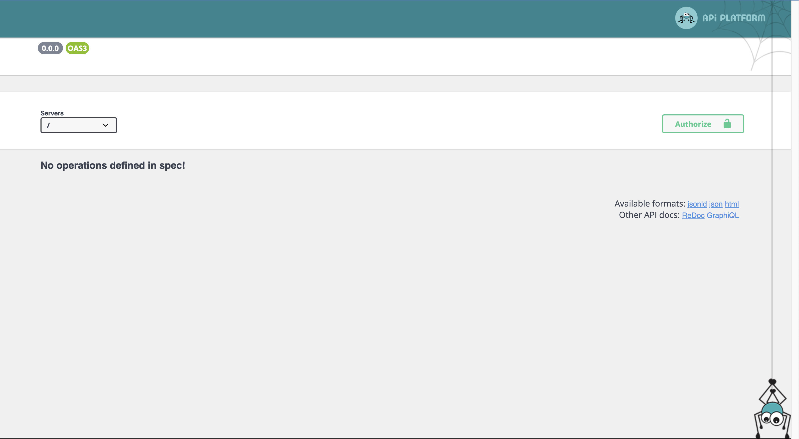
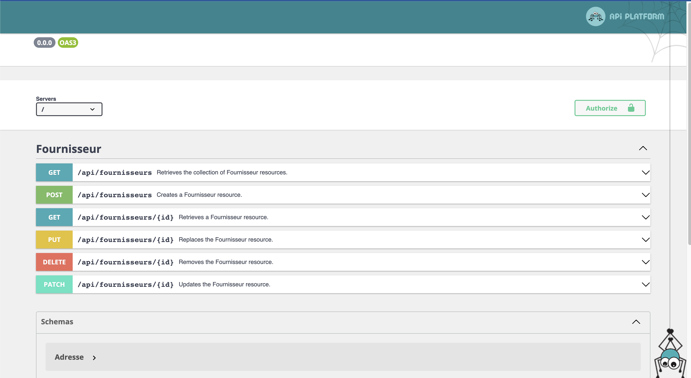
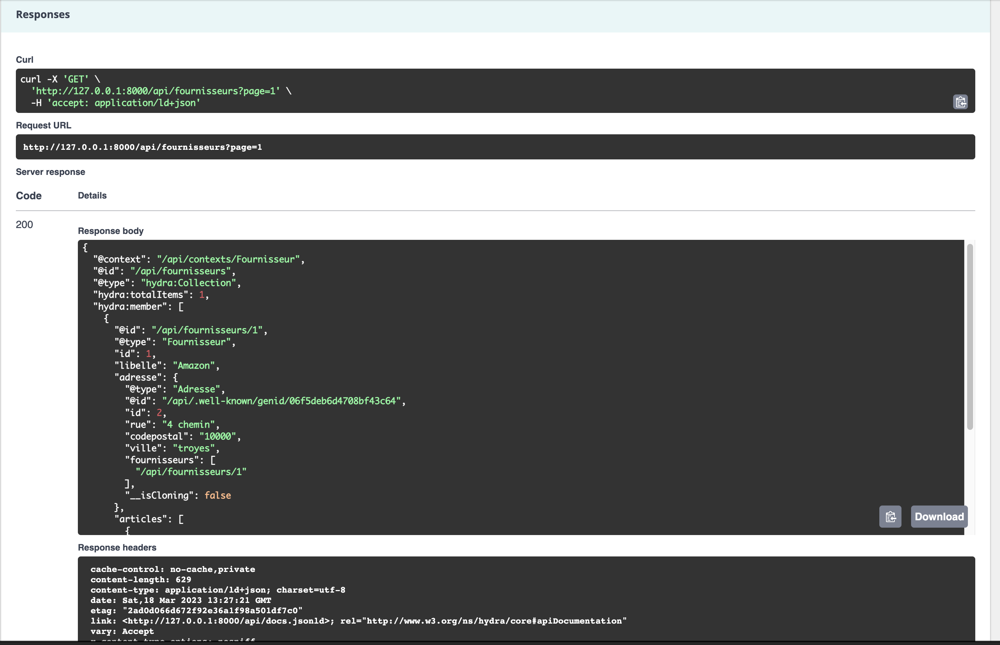

# Séance 7 : Un peu de back ...

Sur cette séance on va installer ApiPlatform, sur un projet symfony qui va nous permettre d'exposer une API REST sur nos entités et ainsi pouvoir accéder et manipuler les données depuis notre application VueJS.

## ApiPlatform

ApiPlatform est un framework qui permet de créer des API REST en quelques lignes de code. Il est basé sur Symfony. Il peut être utilisé seul, ou en complement sur une application Symfony existante.

On parle d'API REST car c'est un standard qui permet de communiquer entre des applications différentes. Il est basé sur le protocole HTTP et utilise les méthodes GET, POST, PUT, DELETE, etc. pour récupérer, créer, modifier et supprimer des données.

ApiPlatform va permettre d'exposer vos entités en tant que ressources, et de créer des routes pour les différentes méthodes HTTP. Il intégre une documentation permettant de tester les routes directement depuis le navigateur.

Il est ensuite possible de tout paramètrer pour configurer des filtres, des routes spécifiques, la sécurité, définir précisement les données accessibles, etc.

La documentation officielle est très complète et permet de bien comprendre le fonctionnement d'ApiPlatform. : [https://api-platform.com/](https://api-platform.com/).

ApiPlatform propose de nombreux formats de sortie, dont JSON-LD, HAL, JSONAPI, etc. Il est possible de configurer les formats de sortie par défaut, et de définir des formats de sortie spécifiques pour chaque ressource.

## Installation

### Récupérer le projet symfony

En partant du dépôt accessible ici : [https://github.com/Dannebicque/baseApi](https://github.com/Dannebicque/baseApi) suivez le readme pour installer le projet.

### Installer ApiPlatform

Pour installer ApiPlatform, il faut d'ajouter le bundle :

```bash
composer require api
```

A ce stade, vous pouvez lancer votre projet et vérifier que tout fonctionne bien. Pour cela rendez vous sur l'url : [http://localhost:8000/api](http://localhost:8000/api) /!\ Evidemment vous devez adapter l'url en fonction de votre configuration. **Il faut  ajouter /api à la fin de l'url de base de votre projet.**

Vous devriez avoir la vue ci-dessous.

<figure><figcaption><p>Apercu de l'interface d'APIPlatform</p></figcaption></figure>

A ce stade aucune de nos entités n'est exposée. Il faut donc pour chacune préciser si elle est exposée, et éventuellement configurer précisément comment elle est exposée (les champs, les droits, ...).

Pour exposer une entité, il faut ajouter l'attribut #[ApiResource()] au dessus de la classe. Par exemple :

```php
<?php

namespace App\Entity;

...
use ApiPlatform\Metadata\ApiResource;
...

#[ORM\Entity(repositoryClass: FournisseurRepository::class)]
#[ApiResource()]
class Fournisseur
{
 ...
}
```

C'est la configuration minimale. Si vous actualisez votre page, vous devriez voir apparaître l'entité Fournisseur dans la liste des ressources exposées.

<figure><figcaption><p>Apercu de l'interface d'APIPlatform avec l'entité Fournisseur exposée</p></figcaption></figure>

Sur cette page vous avez toutes les possibilités offertes par ApiPlatform. Vous pouvez tester les différentes routes, et voir les données retournées. Par défaut vous avez les actions suivantes :

- GET /fournisseurs : récupère la liste des fournisseurs
- POST /fournisseurs : crée un nouveau fournisseur (implique d'envoyer les données associées)
- GET /fournisseurs/{id} : récupère un fournisseur en fonction de son id
- PUT /fournisseurs/{id} : remplace un fournisseur en fonction de son id (implique d'envoyer les données associées) par les nouvelles données
- DELETE /fournisseurs/{id} : supprime un fournisseur en fonction de son id
- PATCH /fournisseurs/{id} : modifie un fournisseur en fonction de son id (implique d'envoyer les données associées)

## Tester l'API

On peut utiliser l'interface proposée par API Platform pour regarder le comportement de notre API. On peut aussi, afin d'avoir un comportement plus proche d'un appel "front" utiliser l'instruction CURL en ligne de commande, ou enfin, utiliser un outil comme Postman qui permet de faire des appels comme le ferait notre interface front. Cet outil est très pratique pour déterminer la structure des URL et des données à fournir, ou des données récupèrée.

Pour ce semestre on va rester dans l'interface proposée par API Platform.

### Premier test 

* Déroulez le menu avec le premier GET /fournisseurs, et cliquez sur "Try It out", puis "Execute"

Vous devriez avoir la réponse ci-dessous :

<figure><figcaption><p>Résultat du Get</p></figcaption></figure>

Par défaut, API Platform propose un format enrichi du [JSON (Json-LD)](https://fr.wikipedia.org/wiki/JSON-LD), qui contient des informations supplémentaires :

```json
{
    "@context": "/api/contexts/Fournisseur",
    "@id": "/api/fournisseurs",
    "@type": "hydra:Collection",
    "hydra:totalItems": 1,
    "hydra:member": [
        {
            "@id": "/api/fournisseurs/1",
            "@type": "Fournisseur",
            "id": 1,
            "libelle": "Amazon",
            "adresse": {
                "@type": "Adresse",
                "@id": "/api/.well-known/genid/efaddf5da154fd23f4a8",
                "id": 2,
                "rue": "4 chemin",
                "codepostal": "10000",
                "ville": "troyes",
                "fournisseurs": [
                    "/api/fournisseurs/1"
                ],
                "__isCloning": false
            },
            "articles": [
                {
                    "@type": "Article",
                    "@id": "/api/.well-known/genid/88f940b8d036e816e519",
                    "id": 1,
                    "designation": "test",
                    "description": "test",
                    "quantite": 12,
                    "prix": 120,
                    "fournisseur": "/api/fournisseurs/1"
                }
            ]
        }
    ]
}
```

Comme vous pouvez le constater, le format est assez verbeux, et contient des informations supplémentaires. Par ailleurs, Fournisseur est lié à une adresse. ApiPlatform récupére automatiquement les données de l'adresse, et les ajoute à la réponse.

Malgré le format et les données supplémentaires, cette réponse se manipule classiquement en javascript. Par exemple, pour récupérer le libellé du fournisseur, il suffit d'écrire :

```javascript
let fournisseur = JSON.parse(response);
console.log(fournisseur['hydra:member'][0].libelle);
```

### A vous de jouer

* Testez depuis ApiPlatform :
  * l'URL pour obtenir les informations d'un fournisseur,
  * l'URL pour ajouter un fournisseur
  * l'URL pour modifier un fournisseur.

* A vous de jouer encore
  * Ajoutez l'entité Article dans Api Platform.
  * Testez les différentes URL pour obtenir les articles, un article, ajouter un article, modifier un article, supprimer un article.